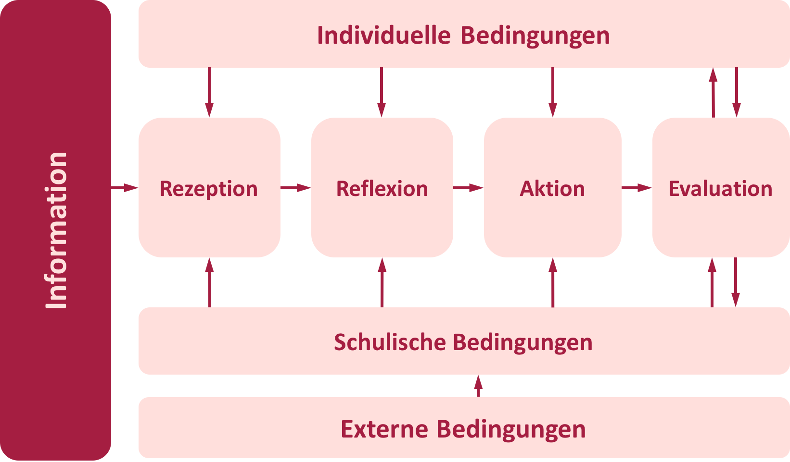
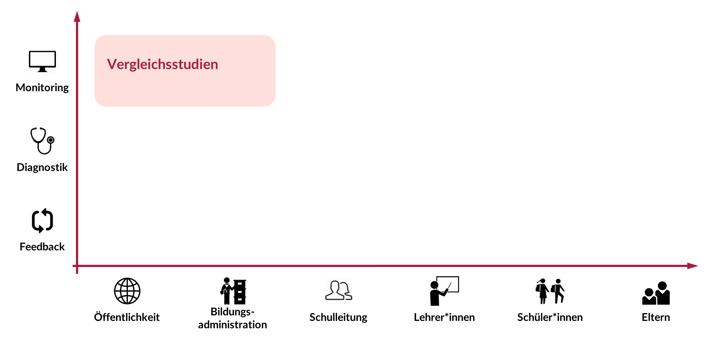
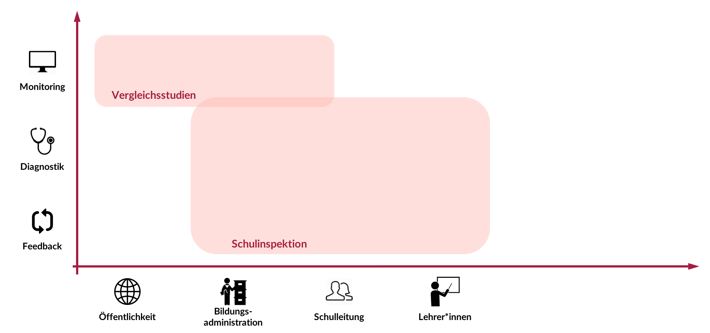
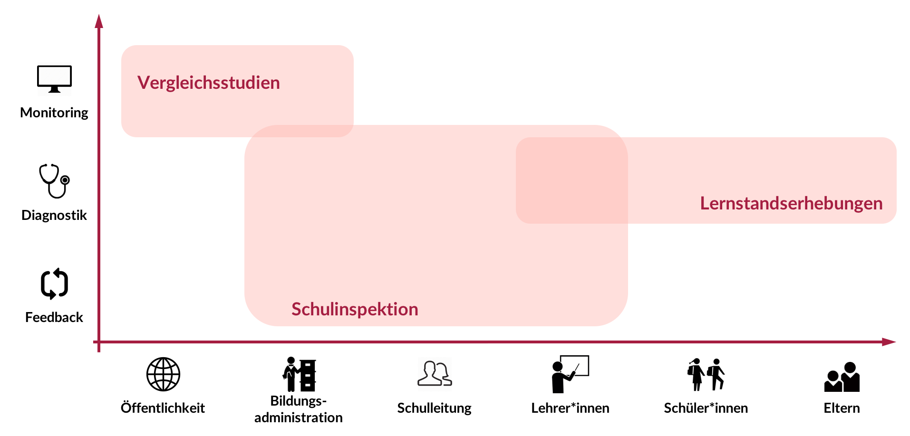
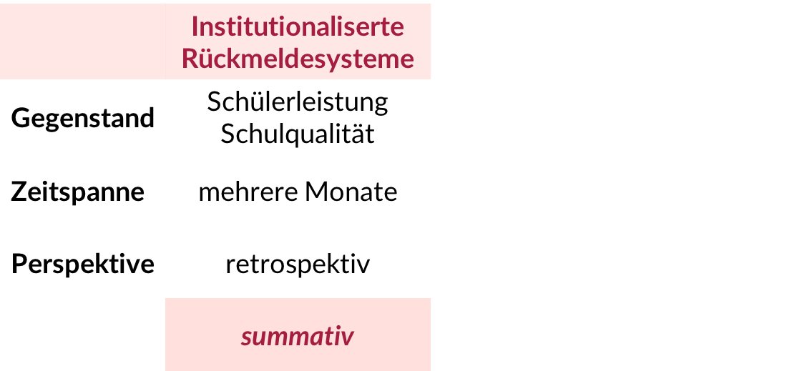
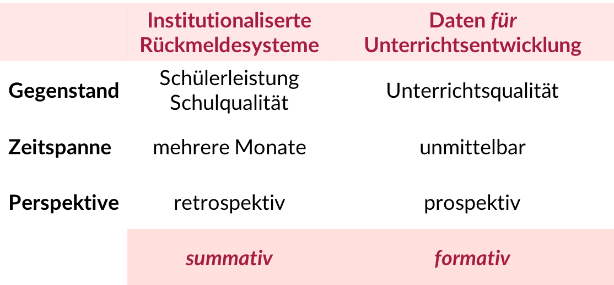

```{r setup, include=FALSE}
knitr::opts_chunk$set(echo = FALSE)
#Bib/library.bib
```

## Inhaltlicher und organisatorischer Überblick
<!--
* Verortung des Vortrags
* Institutionalisierte Rückmeldesysteme
    * Funktion und Adressaten
    * Rahmenmodell
    * Befunde zur Rezeption
* Formative Rückmeldung für die Unterrichtsentwicklung
    * Ableitung und Begründung
    * Potentielle Forschung
* Ausblick  -->

* Verortung des Vortrags
* Datengestützte Unterrichtsentwicklung
    * Rahmenmodell
* Institutionalisierte Rückmeldesysteme
    * Funktion und Adressaten
    * Befunde zur Rezeption
* Formative Rückmeldung für die Unterrichtsentwicklung
    * Begründung und exemplarische Umsetzung
    * Erste Befunde zum Rezeptions- und Reflektionsverhalten


  
  
<div class="centered" font-size=8pt><span style="color:#C57974"><font size="3pt"><p></p><p></p>
<p>Die interaktiven Folien können unter http://bit.ly/2gQTbSj und deren Quellcode</p> <p>unter https://github.com/sammerk/vortrag-tue-w1 abgerufen werden</p></font></span>
</div>

## Verortung des Vortrags

<iframe id="iframe_container" webkitallowfullscreen="" mozallowfullscreen="" allowfullscreen="" src="https://prezi.com/embed/c1rvndbxe3x6/?bgcolor=ffffff&amp;lock_to_path=0&amp;autoplay=0&amp;autohide_ctrls=0&amp;landing_data=bHVZZmNaNDBIWnNjdEVENDRhZDFNZGNIUE43MHdLNWpsdFJLb2ZHanI5aEQ1TVBzWjY5VzdybjRycXpOSUU5M3pRPT0&amp;landing_sign=PihTDvVXzP7XDTFptwZmn1HqeZb70B5WWP69XuYPdUY" width="300" height="255" frameborder="0"></iframe>


# Datengestützte Unterrichtsentwicklung
## Rahmenmodell
<center></center>
<div class="centered" ><font size="-0.7">
Abb. 2: Zyklenmodell "Von der Evaluation zur Innovation" [@Helmke2005]
</font></div>


<div class="centered"><span style="color:#C57974 margin-bottom:2cm"><font size="3pt">
<p class="top-one">Folien: http://bit.ly/2gQTbSj - Quellcode: https://github.com/sammerk/vortrag-tue-w1</p></font></span>
</div>

<style>
  .top-one {
     margin-top: 1cm;
  }
</style>

## Rahmenmodell
<center></center>
<div class="centered" ><font size="-0.7">
Abb. 2: Zyklenmodell "Von der Evaluation zur Innovation" [@Helmke2005]
</font></div>

<div class="centered"><span style="color:#C57974 margin-bottom:2cm"><font size="3pt">
<p class="top-one">Folien: http://bit.ly/2gQTbSj - Quellcode: https://github.com/sammerk/vortrag-tue-w1</p></font></span>
</div>


# Institutionalisierte Rückmeldesysteme
## Institutionalisierte Rückmeldesysteme
<center></center>
<div class="centered" ><font size="-1">
Abb. 3: Primäre Funktionen und Adressaten diverser Rückmeldesysteme [@Altrichter2016]. Eigene Darstellung.
</font></div>
## Institutionalisierte Rückmeldesysteme
<center></center>
<div class="centered" ><font size="-1">
Abb. 3: Primäre Funktionen und Adressaten diverser Rückmeldesysteme [@Altrichter2016]. Eigene Darstellung.
</font></div>
## Institutionalisierte Rückmeldesysteme
<center></center>
<div class="centered" ><font size="-1">
Abb. 3: Primäre Funktionen und Adressaten diverser Rückmeldesysteme [@Altrichter2016]. Eigene Darstellung.
</font></div>


## Summative vs. formative Rückmeldungen
<center></center>
<div class="centered" ><font size="-1">
Tab. 1: Charakteristika formativer und summativer Rückmeldungen an Lehrer*innen [@Gartner2013b; @Maier2008]. Eigene Darstellung.
</font></div>
## Summative vs. formative Rückmeldungen
<center></center>
<div class="centered" ><font size="-1">
Tab. 1: Charakteristika formativer und summativer Rückmeldungen an Lehrer*innen [@Gartner2013b; @Maier2008]. Eigene Darstellung.
</font></div>


## Befunde zur Rezeption und Nutzung {.nullneunem}
* **Summative Leistungsrückmeldung**
    * breite Rezeption [@Dedering2011,; @Schneewind2007]
    * geringe Nutzung zur Unterrichtsentwicklung [@Maier2008]
    * externale Kausalattribution [@Hellrung2013]
* **Formative Rückmeldungen zur Unterrichtsqualität**
    * hohe intrische Motivation zur Rezeption [@Gaertner2014]
    * konstruktive Nutzung zur Unterrichtsentwicklung [@Gaertner2014]
    * positive Wirkung moderiert durch Individuelle Bedingungen [@Ditton2004]
* <span style="color:#a51e41">Methodische Probleme:</span> Selbstauskünfte, hohe Selektivität, nichtexperimentelle/One-Shot Studien, unklare abhängige Konstrukte, ...


# <span style="font-style: italic">Formative</span> Rückmeldungen für die <span style="font-style: italic">Unterrichtsentwicklung</span> 

## Beipiel für formative Rückmeldungen
* Anfrage einer großen Nachhilfeschule nach Qualitätssicherung
* Implementation regelmäßiger Evaluation der Unterrichtsqualität [SEEQ, @Marsh1982, Details siehe Anhang]
* Entwicklung eines Onlineportals zur
    * Zeitnahen bereitstellung formativen Feedback
    * Aufzeichnung des Rezeptionsverhaltensverhaltens (Logdaten)
    
## Das Onlineportal
* Inferenzniveau:
    * Einzelantworten
    * Scores in den Qualitätsdimensionen
    * Freitextantworten
* Bezugsnorm:
    * Likertskalierung
    * soziale Bezugsnorm
    * individuelle Bezugsnorm (ipsative Standardisierung)
* Statistische Kennwerte, Standardisierung, ...
    * siehe www.unterrichtsfeedback.net/demo_abiturma
    
## Erste Befunde zum Rezeptionsverhalten
<iframe id="iframe_container" webkitallowfullscreen="" mozallowfullscreen="" allowfullscreen="" src="https://unterrichtsfeedback.net/logdataapp" width="100%" frameborder="0"></iframe>
    
    
    
    
    
# Herzlichen Dank!    
    
## Anhang I
<iframe id="iframe_container" webkitallowfullscreen="" mozallowfullscreen="" allowfullscreen="" src="Design-Based-Research_Studie.html" width="100%" frameborder="0"></iframe>


<style>
slides > slide { overflow: scroll; }
</style>
## Literatur {.nullvierem}
