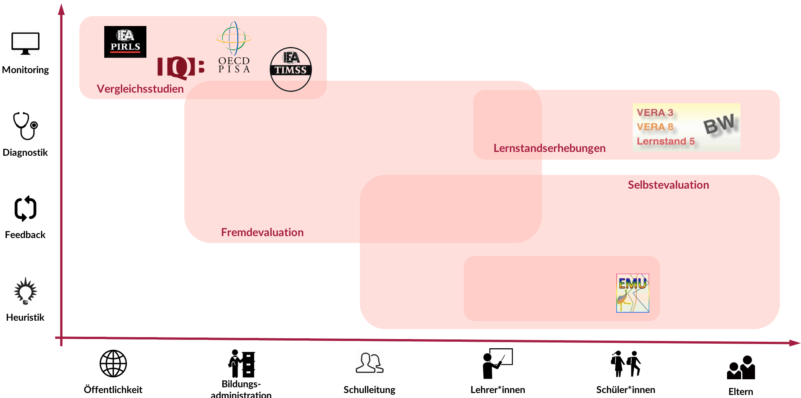

```{r setup, include=FALSE}
knitr::opts_chunk$set(echo = FALSE)
```

## Inhaltlicher und organisatorischer Überblick {.nullneunem}

* Verortung des Vortrags im Forschungsplan
* Institutionalisierte Rückmeldesysteme
    * Funktion und Adressaten
    * Befunde zur Rezeption
* Formative Rückmeldung von Unterrichtsqualitätsdiagnostik
    * Grundidee
    * Befunde zur Rezeption
    * Forschungsplan
* Ausblick  
  
  
<div class="centered" font-size=8pt><span style="color:#C57974"><font size="3pt"><p></p><p></p>
Die interaktiven Folien können unter https://merk.shinyapps.io/mindthegap und deren Quellcode unter https://github.com/sammerk/vortrag-tue-w1 abgerufen werden</font></span>
</div>

## Verortung des Vortrags im Forschungsplan

<iframe id="iframe_container" webkitallowfullscreen="" mozallowfullscreen="" allowfullscreen="" src="https://prezi.com/embed/c1rvndbxe3x6/?bgcolor=ffffff&amp;lock_to_path=0&amp;autoplay=0&amp;autohide_ctrls=0&amp;landing_data=bHVZZmNaNDBIWnNjdEVENDRhZDFNZGNIUE43MHdLNWpsdFJLb2ZHanI5aEQ1TVBzWjY5VzdybjRycXpOSUU5M3pRPT0&amp;landing_sign=PihTDvVXzP7XDTFptwZmn1HqeZb70B5WWP69XuYPdUY" width="300" height="255" frameborder="0"></iframe>

# Institutionalisierte Rückmeldesysteme
## Funktionen und Adressaten
<center></center>
<div class="centered" ><font size="-1">
Abb. 1: Primäre Funktionen und Adressaten diverser Rückmeldesysteme [@Altrichter2016]. Eigene Darstellung.
</font></div>

     
## Befunde zur Rezeption
* Test test
    * Test


## Literatur {.nullvierem}
