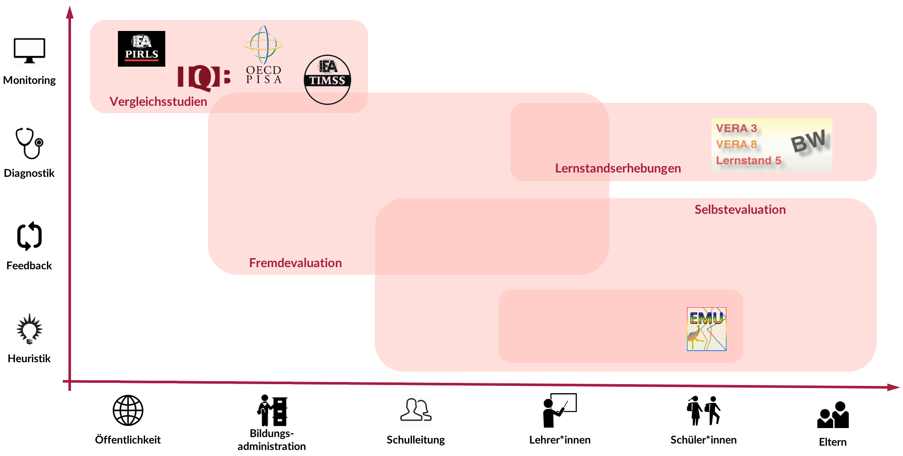
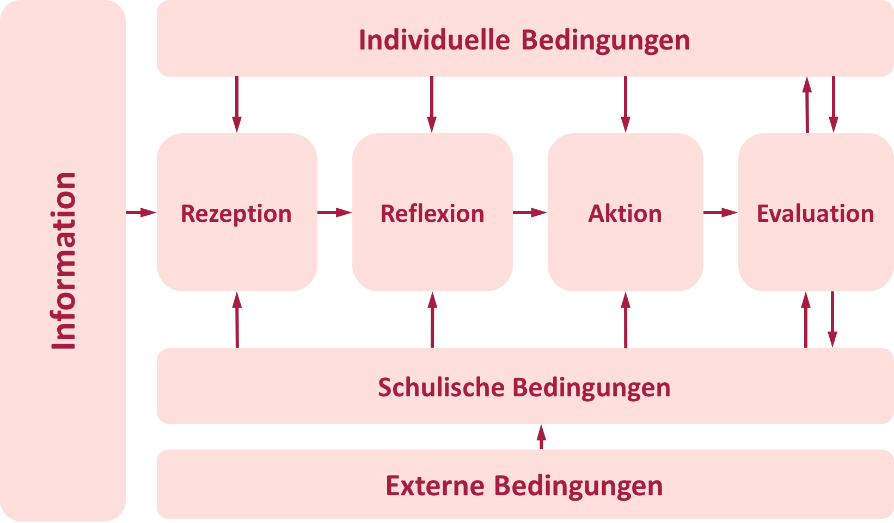
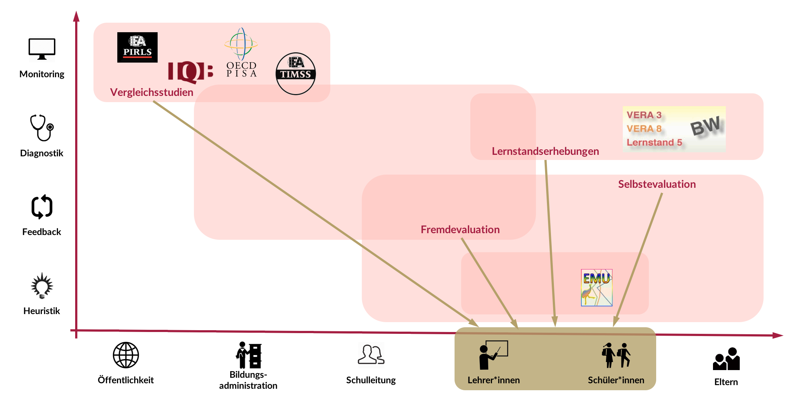

```{r setup, include=FALSE}
knitr::opts_chunk$set(echo = FALSE)
```

## Inhaltlicher und organisatorischer Überblick {.nullneunem}

* Verortung des Vortrags im Forschungsplan
* Institutionalisierte Rückmeldesysteme
    * Funktion und Adressaten
    * Rahmenmodell
    * Befunde zur Rezeption
* Formative Rückmeldung für die Unterrichtsentwicklung
    * Ableitung und Begründung
    * Potentielle Forschung
* Ausblick  
  
  
<div class="centered" font-size=8pt><span style="color:#C57974"><font size="3pt"><p></p><p></p>
Die interaktiven Folien können unter https://merk.shinyapps.io/mindthegap und deren Quellcode unter https://github.com/sammerk/vortrag-tue-w1 abgerufen werden</font></span>
</div>

## Verortung des Vortrags im Forschungsplan

<iframe id="iframe_container" webkitallowfullscreen="" mozallowfullscreen="" allowfullscreen="" src="https://prezi.com/embed/c1rvndbxe3x6/?bgcolor=ffffff&amp;lock_to_path=0&amp;autoplay=0&amp;autohide_ctrls=0&amp;landing_data=bHVZZmNaNDBIWnNjdEVENDRhZDFNZGNIUE43MHdLNWpsdFJLb2ZHanI5aEQ1TVBzWjY5VzdybjRycXpOSUU5M3pRPT0&amp;landing_sign=PihTDvVXzP7XDTFptwZmn1HqeZb70B5WWP69XuYPdUY" width="300" height="255" frameborder="0"></iframe>

# Institutionalisierte Rückmeldesysteme
## Funktionen und Adressaten
<center></center>
<div class="centered" ><font size="-1">
Abb. 2: Primäre Funktionen und Adressaten diverser Rückmeldesysteme [@Altrichter2016]. Eigene Darstellung.
</font></div>

## Rahmenmodell
<center></center>
<div class="centered" ><font size="-1">
Abb. 3: Zyklenmodell von der Evaluation zur Innovation [@Helmke2005]
</font></div>

## Befunde zur Rezeption {.nullneunem}
* Größtenteils wird die Rezeption von **Leistungsrückmeldung** untersucht [@Penny2004; @Gartner2013]
* Befunde zum Rezeptionsverhalten und dem Verständis sind sehr heterogen:
    * Spezifisch für deutschsprachige Selbstauskünfte: **breite Rezeption, gutes globales Verständis, hohe prinzipielle Nützlichkeit** [@Dedering2011; @Schneewind2007]
    * Internationale Selbstauskünfte: Große Probleme mit **deskriptiver/inferentieller Statistik**, kaum **systematische** Rezeption und Reflektion durch die Kollegien [@Hambleton1997; @Koch2011; @Maier2010d]
* Befunde zum Nutzungsverhalten eher pessimistisch:
    * Vornehmlich strategische anstatt instrumentelle/konzeptionelle Nutzung [@Amrein-Beardsley2010; @Maier2008]
    * Primär Handlungsimpulse für Reorganisation von Curriculara und Lerngruppen [@Ashby2001; @Kirkup2005]
* <span style="color:#a51e41">Methodische Probleme:</span> Selbstauskünfte, hohe Selektivität, nichtexperimentelle/One-Shot Studien, unklare abhängige Konstrukte, ...


# <span style="font-style: italic">Formative</span> Rückmeldungen für die <span style="font-style: italic">Unterrichtsentwicklung</span> 

## Ableitung und Begründung {.nullneunem}
* Institutionalisierte Rückmeldesysteme geben (größtenteils) **summative** Rückmeldungen zu **distalen** Größen
* **Formatives** Feedback (Feedback <span style="font-style: italic">for</span> Learning) gilt als eine der **einflussreichsten Größen** (i.S. hinr. Bed.) für das Lernen im Allgemeinen [@Ditton2014; @Hattie2007; @Kluger1996]
* UQ als Interaktionsprodukt von Lerngruppe und Lehrkraft ist 
    * starker Prädiktor von Lernerfolg [@Kane2013] und 
    * **proximal/heuristisch** zur/für die Unterrichtsentwicklung [@Helmke2009]
* UQ wird bereits von den meisten Rückmeldesystemen erfasst 
<center></center>
<div class="centered" >
<font size="-1">
Abb. 4: Potentielle Datenquellen formativer Rückmeldung von Unterrichtsqualität
</font></div>  

## Potentielle Forschung
* **Rezeption** formativer Rückmeldungen von Unterrichtsqualität
    * Effekte der Gestaltung: Inferenzniveau der Daten, Bezugsnorm, Gegenstand, Skalierung, statistische Kennwerte
    * Effekte individueller, schulischer und außerschulischer Bedingungen
* **Gestaltung** formativer Rückmeldungen
    * Cues, Interaktivität, Zeitpunkt
* **Interventionen** zur Förderung korrekter und günstiger Rezeption
    * Datenkompetenz, Bezugsnormorientierung
<div class="centered" font-size=6pt><span style="color:#C57974"><font size="6pt"><p></p>
Hohe Synergie möglich: Daten sind vorhanden, Feld ist interessiert, Probanden werden entlastet, Ergebnisse unmittelbar praxisrelevant</font></span>
</div>

# Ausblick
    
## Erste Befunde einer DBR-Studie I
<iframe id="iframe_container" webkitallowfullscreen="" mozallowfullscreen="" allowfullscreen="" src="Design-Based-Research_Studie.html" width="100%" frameborder="0"></iframe>

## Erste Befunde einer DBR-Studie II
```{r, echo = FALSE}
library(shiny)
shinyAppDir(
  system.file("shiny", package="shiny"),
  options=list(
    width="100%", height=700
  )
)

```


<style>
slides > slide { overflow: scroll; }
</style>
## Literatur {.nullvierem}
