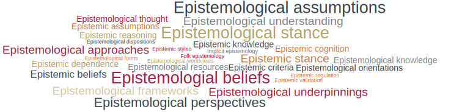
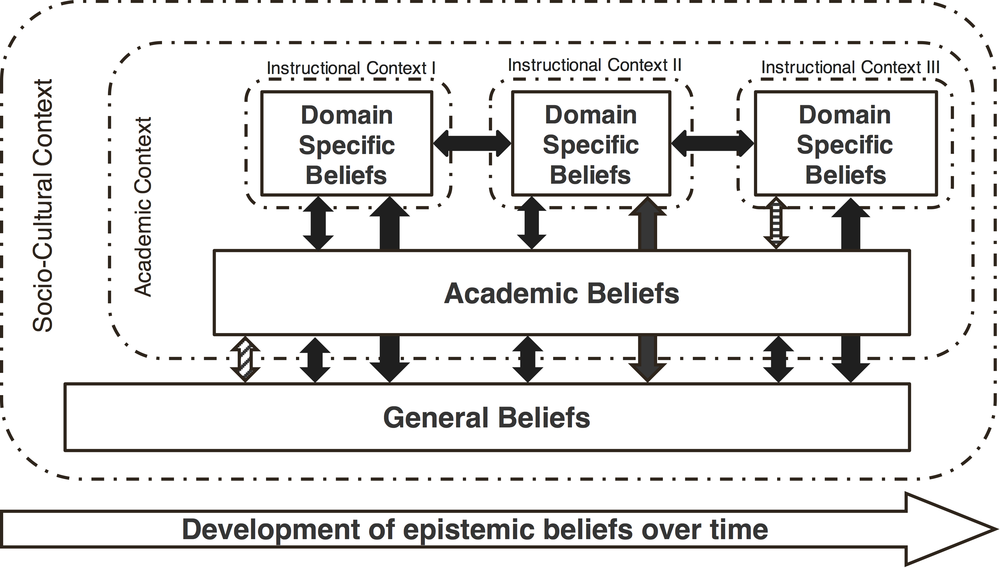
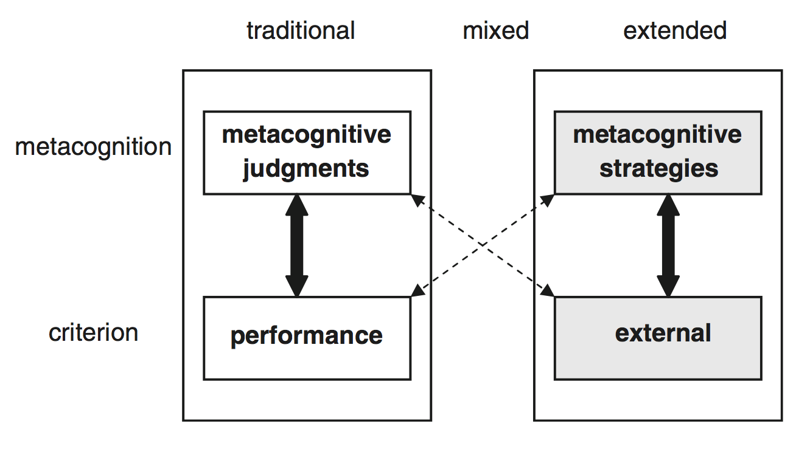
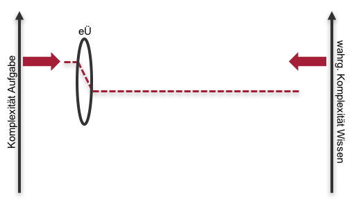
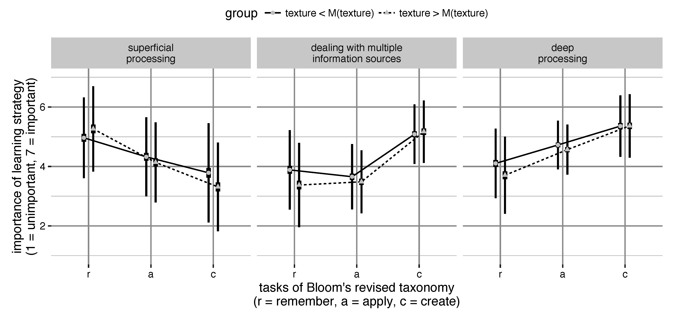

```{r setup, include=FALSE}
knitr::opts_chunk$set(echo = FALSE)
```

## Inhaltlicher und organisatorischer Überblick {.nullneunem}

* Verortung des Vortrags im Forschungsplan
* Institutionalisierte Rückmeldesysteme
    * Funktion und Addressaten
    * Konzeptualisierungen
    * kritische Diskussion
* Synopse zentraler Befunde
    * Epistemische Überzeugungen sind **dualer Natur**
    * Epistemische Überzeugungen **kalibrieren die Lernstrategienwahl**
    * Epistemische Überzeugungen **sind funktional für das Interesse an/die Praxisrelevanzeinschätzung von** bildungswissenschaftlichem Wissen
* Ausblick  
  
  
<div class="centered" font-size=8pt><span style="color:#C57974"><font size="3pt"><p></p><p></p>
Die interaktiven Folien können unter https://merk.shinyapps.io/mindthegap und deren Quellcode unter https://github.com/sammerk/berufungsvortrag_W1_Tue abgerufen werden</font></span>
</div>

# Epistemische Überzeugungen


## Zugänge zur Begrifflichkeit I
* **Ethymologie**
     * Episteme = Erkenntnis, Wissen, Wissenschaft
     * Logos = Wissenschaft, Lehre [@Meidl2009]
* **Konvention**
     * Epistemologie = Wissenschaftstheorie, -lehre; Erkenntnistheorie, -lehre [@duden]
* **Wörtliche Übersetzung**
     * epistemologische Überzeugung = Überzeugung die Wissenschaftstheorie betreffend
     * epistemische Überzeugungen = wissenschaftstheoretische Entitäten betreffende Überzeugung [@Kitchener2002]


     
## Zugänge zur Begrifflichkeit II {.nullneunem}
* **In Überblicksarbeiten**
     * Definition I: *[...] refers to what individuals think knowledge is and how they think that they and others know.* [@Hofer2012]
     * Definition II: *[...] refers to the theories or beliefs that students (and other individuals) hold about knowledge and the process of knowing.* [@Braten2010]  
* **"Epistemic Somethings" vs "epistemologische Überzeugungen"**
     *   
* **Arbeitsdefinition:** Überzeugungen bzgl. der Natur und Genese von Wissen

## Überblick zentraler Konzeptualisierungen

<iframe src="https://prezi.com/embed/w0zgmp8dxqos/?bgcolor=ffffff&amp;lock_to_path=0&amp;autoplay=0&amp;autohide_ctrls=0&amp;landing_data=bHVZZmNaNDBIWnNjdEVENDRhZDFNZGNIUE43MHdLNWpsdFJLb2ZHanI0VnM5UWxrVXl0cVR5U3RpNWpTMnQvTjFRPT0&amp;landing_sign=hHmKC9yUL5vi_GEr6Cmct-iMGS5pEINiV7IMQFz5f0A" allowfullscreen="" mozallowfullscreen="" webkitallowfullscreen="" id="iframe_container" frameborder="0" height=200px width=355px></iframe>

## Konzeptuelle und methodologische Kritik {.nullachtem}

* Inhaltsvalidität [@Hartig2008]
     * **Dimensionale Konzeptualisierungen:** Definition der Dimensionen, **epistemischer** Charakter der Items [@Bromme2008; @Schommer1990; @Stahl2011]
     * **Positionale Konzeptualisierungen:** Sind Streitfragen/Interviewstimuli geeignet, epistemische Überzeugungen *exklusiv, exhaustiv und in ausgewogenem Verhältnis* [@Hartig2008, S. 152] abzubilden?
     
* Konstruktvalidität [@Messick1995]
     * **Dimensionale Konzeptualisierungen:** 
          * Faktorenstruktur wird selten überprüft/entspricht selten den Annahmen [@Hofer1997; @Muis2006; @Priemer2006]
          * Interpretation der Faktoren als naiv--sophistiziert Kontinuum kann problematisch sein [@Elby2001; @Klopp2014; @Peter2015; @Stahl2011]
     * **Positionale Konzeptualisierungen:** 
          * Allg. Kritik an der Eindimensionalitätsannahme [@Hofer1997; @Limon2006; @Priemer2006]
          * Operationalisierung widerspricht in vielen Fällen der Eindimensionalitätsannahme [@Barzilai2015; @King1994; @Krettenauer2004; @Kuhn2000; @Peter2015]


# Duale Natur epistemischer Überzeugungen Lehramtsstudierender

## Duale Natur: Rahmenmodell {.nullsiebenem}
<center></center>
<div class="centered">
Abb. 1: Theory of Integrated Domains in Epistemology. Abb. nach (Muis et al., 2006, S. 30).
</div>

## Duale Natur: Forschungsstand {.nullachtem}
* Es wird entweder within- oder between-person Domänenspezifität untersucht [@Buehl2002; @Muis2006]
* Ergebnisse einer einschlägigen Review von Muis, Bendixen, & Haerle [-@Muis2006]
     * |                      | within-design | between-design |
       |----------------------|:-------------:|:--------------:|
       | Domänenspezifität    | 4             | 8              |
       | Domänengeneralität   | 1             | 0              |
       | Duale Natur          | 6             | 0              |
* Kritik: Theoretische Einbettung unklar; Untersuchungsdesigns teilw. inadäquat [@Limon2006; @Merk2016b; @Trautwein2004]


## Duale Natur: Eigene Befunde
* Between-person Differenzen in epistemischen Überzeugungen zu bildungswissenschaftlichem Wissen sind sowohl aus dimensionaler [@Merk2016e] als auch aus positionaler [@Merk2016b; @Merk2016d] und personaler [@Merk2013] Perspektive eher kleiner oder moderater Größe
* Within-person Variation in epistemischen Überzeugungen ist sowohl über verschiedene Disziplinen [@Merk2016b] als auch innerhalb der Bildungswissenschaften [@Merk2016e; @Merk2016d] erheblich
* Kontexte scheinen eine wesentlich geringere Rolle zu spielen als der Gegenstand selbst [@Merk2016d]


## Duale Natur: Interaktives Datenbeispiel {.nullachtem}
<iframe src="http://46.101.230.125:3838/mind_the_gap/" allowfullscreen="" mozallowfullscreen="" webkitallowfullscreen="" id="iframe_container" frameborder="0" height=200px width=355px></iframe>


## Duale Natur: Modellierung {.nullsechsem}
<center></center>

Abb. 2: Pfaddiagramm eines MLSEM ($\chi^2$ = 234.789, df = 134, RMSEA = 0.020, CFI = 0.938, TLI = 0.925 SRMR.Within = 0.028, SRMR.Between = 0.064). Die Residualkovarianz $Cov(gr_{1ij}^{b}, gr_{3ij}^{b})$ sowie das Messmodell des D-Indexes (= di) sind nicht dargestellt.
$X_{ij}^{w/b}$ = within/between-Variable X bezüglich Gegenstand i und Person j; tr = TR = theorienspezifischer Relativismus; CM = Cognitive Theory of Multimedia Learning; BF = Big Fish Little Pond Effect; BM = Bullying Mobbing; IN = Inklusion; GT = Ganztagesschule.
Alle Modellpfade sind bei p = .01 signifikant.


# Die Kalibrierungshypothese

## Die Kalibrierungshypothese I
* Erweiterung des klassischen Kalibrierungsbegriffs [@Alexander2013; @Nelson1991] durch Stephanie Pieschl [@Pieschl2009]

<center> 
<div class="centered" ><font size="-1">
Abb. 4: Erweiterte Definition des Kalibrierungsbegriffs nach [@Pieschl2009]. Abbildung (ebd. S. 16).
</font></div>


## Die Kalibrierungshypothese II
*  Kalibrierende Wirkung epistemischer Überzeugungen als "Linsenfunktion" [@Bromme2010]
<center></center>
<div class="centered" ><font size="-1">
Abb. 5: Erweiterte Kalibrierung als Linsenfunktion nach [@Pieschl2009]. Eigene Darstellung.
</font></div>


## Kalibrierungshypothese: Eigener Befund {.nullachtem}

<center></center>
<div class="centered" ><font size="-1">
Abb. 6: Stichprobe: <i>N</i> = 805 Lehramtsstudierende im Grundstudium; Material: Drei Aufgaben unterschiedlicher Komplexität (revidiert) nach Bloom [@Anderson2001], COPES-Questionaire [@Pieschl2008c], CAEB [@Stahl2006].
</font></div>


## Literatur {.nullvierem}
