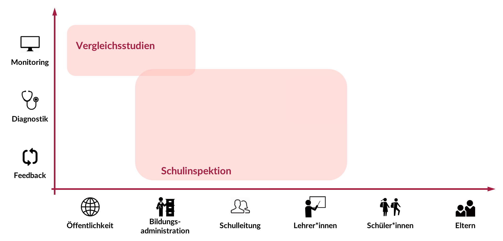
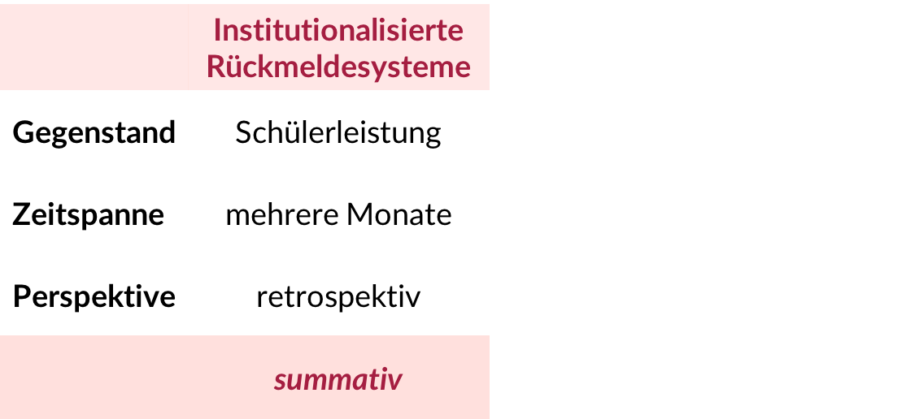
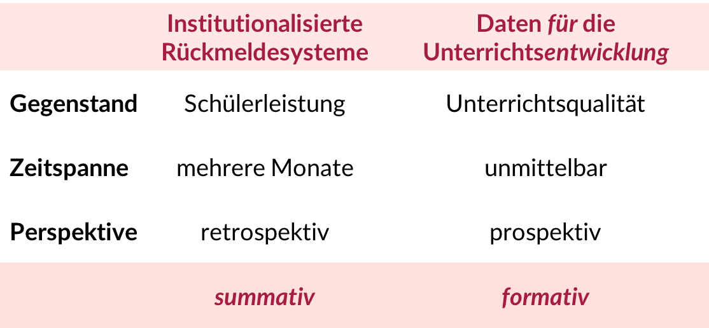
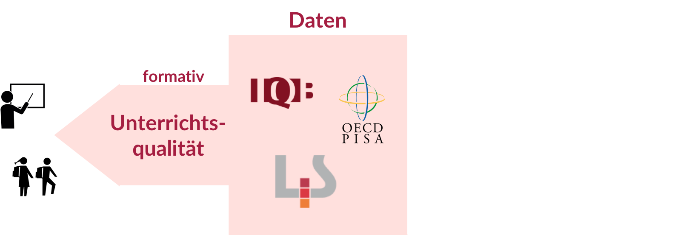
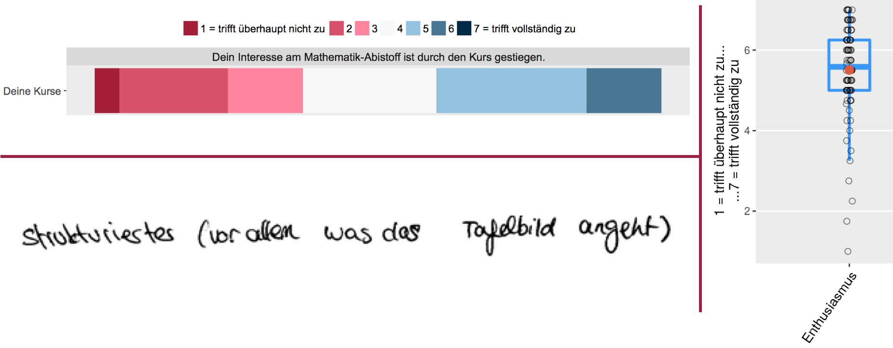
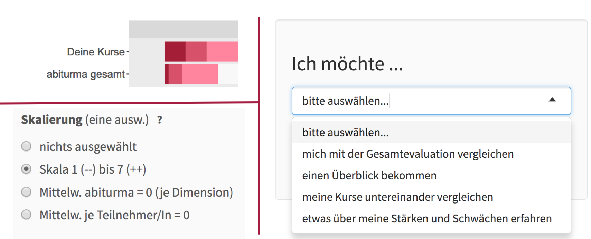

```{r setup, include=FALSE}
knitr::opts_chunk$set(echo = FALSE)
# ../../../../../../Downloads/library.bib
```

## Inhaltlicher und organisatorischer Überblick
<!--
* Verortung des Vortrags
* Institutionalisierte Rückmeldesysteme
    * Funktion und Adressaten
    * Rahmenmodell
    * Befunde zur Rezeption
* Formative Rückmeldung für die Unterrichtsentwicklung
    * Ableitung und Begründung
    * Potentielle Forschung
* Ausblick  -->

1. Verortung des Vortrags
2. Datengestützte Unterrichtsentwicklung
     * Rahmenmodell
3. Institutionalisierte Rückmeldesysteme
     * Funktion und Adressaten
     * Befunde zur Rezeption
4.  Formative Rückmeldung für die Unterrichtsentwicklung
     * Grundidee
     * Exemplarische Umsetzung & Erste Befunde


  
  
<div class="centered" font-size=8pt><span style="color:#C57974"><font size="3pt"><p></p><p></p>
<p>Die interaktiven Folien können unter http://bit.ly/2gQTbSj und deren Quellcode</p> <p>unter https://github.com/sammerk/vortrag-tue-w1 abgerufen werden</p></font></span>
</div>

## Verortung des Vortrags

<iframe id="iframe_container" webkitallowfullscreen="" mozallowfullscreen="" allowfullscreen="" src="https://prezi.com/embed/c1rvndbxe3x6/?bgcolor=ffffff&amp;lock_to_path=0&amp;autoplay=0&amp;autohide_ctrls=0&amp;landing_data=bHVZZmNaNDBIWnNjdEVENDRhZDFNZGNIUE43MHdLNWpsdFJLb2ZHanI5aEQ1TVBzWjY5VzdybjRycXpOSUU5M3pRPT0&amp;landing_sign=PihTDvVXzP7XDTFptwZmn1HqeZb70B5WWP69XuYPdUY" width="300" height="255" frameborder="0"></iframe>


# Datengestützte Unterrichtsentwicklung
## Rahmenmodell
<center></center>
<div class="centered" ><font size="-0.7">
Abb. 2: Zyklenmodell "Von der Evaluation zur Innovation" [@Helmke2005]
</font></div>


<div class="centered"><span style="color:#C57974 margin-bottom:2cm"><font size="3pt">
<p class="top-one">Folien: http://bit.ly/2gQTbSj - Quellcode: https://github.com/sammerk/vortrag-tue-w1</p></font></span>
</div>

<style>
  .top-one {
     margin-top: 1cm;
  }
</style>
<style>
  .top-three {
     margin-top: 3cm;
  }
</style>

## Rahmenmodell
<center></center>
<div class="centered" ><font size="-0.7">
Abb. 2: Zyklenmodell "Von der Evaluation zur Innovation" [@Helmke2005]
</font></div>

<div class="centered"><span style="color:#C57974 margin-bottom:2cm"><font size="3pt">
<p class="top-one">Folien: http://bit.ly/2gQTbSj - Quellcode: https://github.com/sammerk/vortrag-tue-w1</p></font></span>
</div>


# Institutionalisierte Rückmeldesysteme
## Institutionalisierte Rückmeldesysteme
<center></center>
<div class="centered" ><font size="-0.7">
Abb. 3: Primäre Funktionen und Adressaten diverser Rückmeldesysteme [@Altrichter2016]. Eigene Darstellung.
</font></div>
<div class="centered"><span style="color:#C57974 margin-bottom:2cm"><font size="3pt">
<p class="top-one">Folien: http://bit.ly/2gQTbSj - Quellcode: https://github.com/sammerk/vortrag-tue-w1</p></font></span>
</div>
## Institutionalisierte Rückmeldesysteme
<center></center>
<div class="centered" ><font size="-1">
Abb. 3: Primäre Funktionen und Adressaten diverser Rückmeldesysteme [@Altrichter2016]. Eigene Darstellung.
</font></div>
<div class="centered"><span style="color:#C57974 margin-bottom:2cm"><font size="3pt">
<p class="top-one">Folien: http://bit.ly/2gQTbSj - Quellcode: https://github.com/sammerk/vortrag-tue-w1</p></font></span>
</div>
## Institutionalisierte Rückmeldesysteme
<center></center>
<div class="centered" ><font size="-1">
Abb. 3: Primäre Funktionen und Adressaten diverser Rückmeldesysteme [@Altrichter2016]. Eigene Darstellung.
</font></div>
<div class="centered"><span style="color:#C57974 margin-bottom:2cm"><font size="3pt">
<p class="top-one">Folien: http://bit.ly/2gQTbSj - Quellcode: https://github.com/sammerk/vortrag-tue-w1</p></font></span>
</div>

## Rückmeldesysteme für die Akteure?
## Rückmeldesysteme für die Akteure?
<style>
  .top-two {
     margin-top: 2cm;
  }
</style>
<center></center>
<div class="centered" ><font size="-0.8">
Tab. 1: Nach Gärtner [-@Gartner2013b] und Maier [-@Maier2008]. Eigene Darstellung.
</font></div>
## Rückmeldesysteme für die Akteure?
<center></center>
<div class="centered" ><font size="-0.7">
Tab. 1: Nach Gärtner [-@Gartner2013b] und Maier [-@Maier2008]. Eigene Darstellung.
</font></div>
## Rückmeldesysteme für die Akteure?
<center></center>
<div class="centered" ><font size="-0.7">
Tab. 1: Nach Gärtner [-@Gartner2013b] und Maier [-@Maier2008]. Eigene Darstellung.
</font></div>


## Befunde zur Rezeption und Nutzung 
* **Summative Leistungsrückmeldung**
    * breite Rezeption [@Dedering2011,; @Schneewind2007]
    * geringe Nutzung zur Unterrichtsentwicklung [@Maier2008]
    * externale Kausalattribution [@Hellrung2013]
* **Formative Rückmeldungen zur Unterrichtsqualität**
    * hohe intrinsische Motivation zur Rezeption [@Gaertner2014]
    * konstruktive Nutzung zur Unterrichtsentwicklung [@Gaertner2014]
    * positive Wirkung auf Unterrichtsentwicklung (moderiert durch Individuelle Bedingungen) [@Ditton2004]
* <span style="color:#a51e41" class="top-one">Methodische Probleme:</span> Selbstauskünfte, hohe Selektivität, nichtexperimentelle/One-Shot-Studien, unklare abhängige Konstrukte, ...</span>


# Rückmeldungen für die Unterrichtsentwicklung

## Grundidee
<center></center>

## Grundidee
<center></center>

## Grundidee
<center></center>

## Exemplarische Umsetzung
* Anfrage einer großen Nachhilfeschule ($N_{Level_1}$ = 9730 Schüler\*innen; $N_{Level_2}$ = 189 Lehrer\*innen = Studierende) nach Qualitätssicherung
* Implementation regelmäßiger Evaluation der Unterrichtsqualität [SEEQ, @Marsh1982, Details siehe Anhang]
* Entwicklung eines Onlineportals zur
    * zeitnahen Bereitstellung formativen Feedbacks
    * Aufzeichnung des Rezeptionsverhaltens (Logdaten)
    
## Das Onlineportal (einige Aspekte)
* Inferenzniveau [@Rindermann1999]
    * Einzelantworten, Skalenwerte, Freitextantworten
      <center></center>

## Das Onlineportal (einige Aspekte)
* Bezugsnorm [@Rheinberg2001]
    * kriteriale Norm, soziale Bezugsnorm, intraindividuelle Bezugsnorm
    <center></center>

# Erste Befunde zum Rezeptionsverhalten
## Verweildauer und Informativität
<iframe id="iframe_container" webkitallowfullscreen="" mozallowfullscreen="" allowfullscreen="" src="https://unterrichtsfeedback.net/logdataapp" width="100%" frameborder="0"></iframe>
    
    
## Grundidee in diversen Kontexten
<center></center>
    
    
# Herzlichen Dank!    

# Anhang I
## Potentielle (experimentelle) Forschung
* **Gestaltung** formativer Rückmeldungen
    * Cues, Interaktivität, Zeitpunkt
* **Rezeption** formativer Rückmeldungen von Unterrichtsqualität
    * Effekte der Gestaltung: Inferenzniveau der Daten, Bezugsnorm, Gegenstand, Skalierung, statistische Kennwerte
    * Effekte individueller, schulischer und außerschulischer Bedingungen
* **Interventionen** zur Förderung korrekter und günstiger Rezeption
    * Datenkompetenz, Bezugsnormorientierung
<div class="centered" font-size=6pt><span style="color:#C57974"><font size="6pt"><p></p>
Hohe Synergie möglich: Daten sind vorhanden, Feld ist interessiert, Probanden werden entlastet, Ergebnisse unmittelbar praxisrelevant</font></span>
</div>


# Anhang II
## Psychometrie SEEQ
<iframe id="iframe_container" webkitallowfullscreen="" mozallowfullscreen="" allowfullscreen="" src="Design-Based-Research_Studie.html" width="100%" frameborder="0"></iframe>


## Skalenhandbuch Lehrerfragebogen
<iframe id="iframe_container" webkitallowfullscreen="" mozallowfullscreen="" allowfullscreen="" src="Img/Skalenhandbuch_abiturma_survey_fr_16_Gruppe2.html" width="100%" frameborder="0"></iframe>

<style>
slides > slide { overflow: scroll; }
</style>
## Literatur {.nullvierem}
