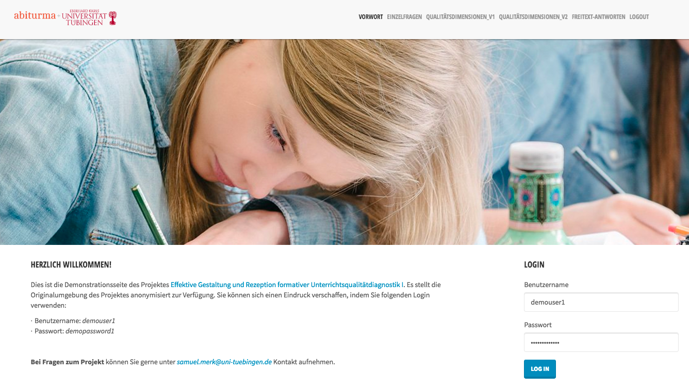
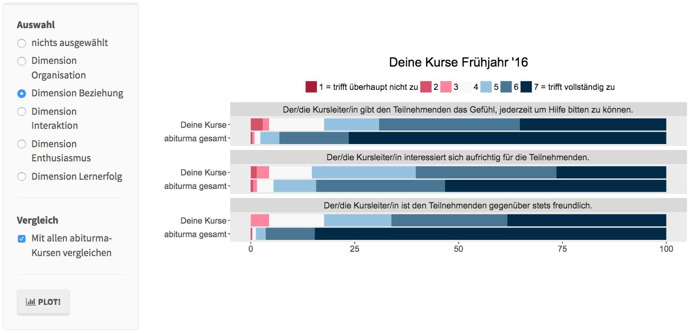
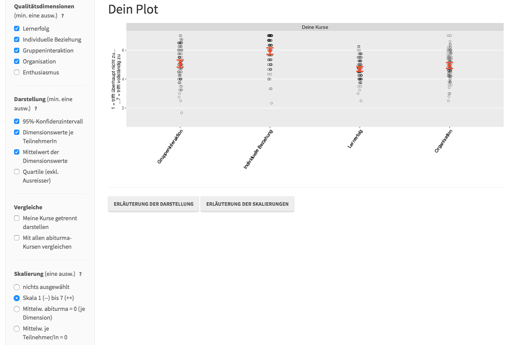
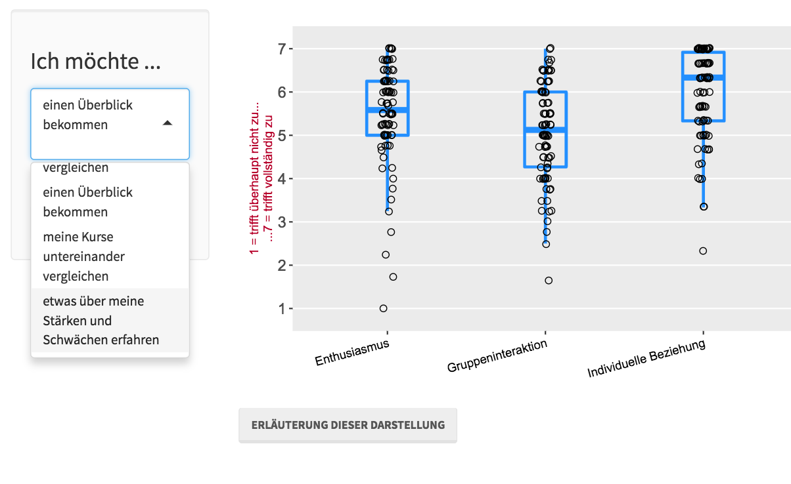
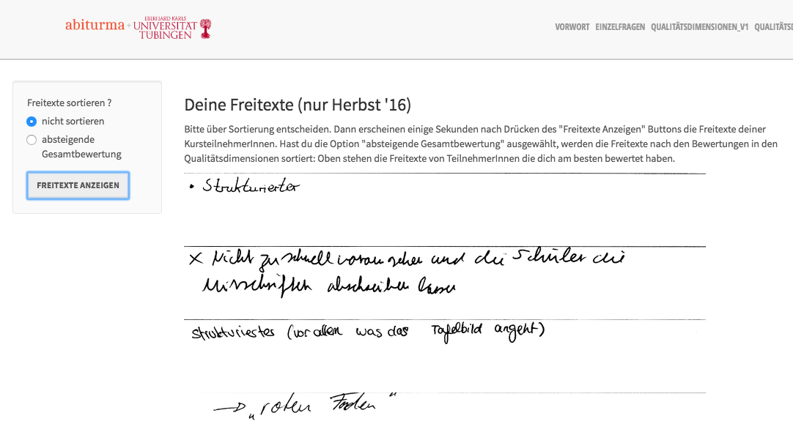

```{r fb_data and log_data reading, cache = T, echo=FALSE, results='hide', message=FALSE, warning=FALSE}
library(readr)
library(tidyverse)
## Import sus_fb_data
sus_fb_data <- read_delim("data/sus_fb_data_abiturma_fr16.csv", ";")

## Import kl_fb_data
kl_fb_data <- read_delim("data/kl_fb_data_abiturma_fr16_ohne_labels.csv", "|", escape_double = TRUE )

### Import der jitter logfiles
files_jitter      <- list.files("data/logdata/rawdata_17/responses_jitter",   full.names = T)
files_likert_1    <- list.files("data/logdata/rawdata_17/responses_likert",   full.names = T)
files_likert_2    <- list.files("data/logdata/rawdata_18/responses_likert",   full.names = T)
files_dropdown    <- list.files("data/logdata/rawdata_18/responses_qualdim2", full.names = T)
files_freitexte_1 <- list.files("data/logdata/rawdata_17/responses_freitext", full.names = T)
files_freitexte_2 <- list.files("data/logdata/rawdata_18/responses_freitext", full.names = T)

log_files <- c(files_jitter,    
               files_likert_1,   
               files_likert_2,   
               files_dropdown,   
               files_freitexte_1,
               files_freitexte_2)

## Reading and Merging jitter logs
for (file in log_files){
  
  # if the merged dataset doesn't exist, create it
  if (!exists("log_data_raw")){
    log_data_raw <- read_delim(file, ",", col_types = cols(.default = col_character()))
  }
  
  # if the merged dataset does exist, append to it
  if (exists("log_data_raw")){
    temp_dataset <-read_delim(file, ",", col_types = cols(.default = col_character()))
    log_data_raw <- merge(log_data_raw, temp_dataset, all = T)
    rm(temp_dataset)
  }
}
```

```{r logdatawrangling2, echo=F, results="hide", warning=F, message=F}
library(tidyverse)
log_data <- log_data_raw[grepl("[@]", log_data_raw$user), ] ## Filtern der Zeilen mit Kommata 
log_data <- log_data%>%                                     ## in IP-Adresse
  mutate(user = factor(user),
         systtime = lubridate::ymd_hms(systtime))%>%
  tbl_df()%>%
  filter(systtime > lubridate::ymd_hms("2016-06-30 18-00-00"))%>%  ## Test-Logins vor Release-Time filtern
  group_by(user)%>%                                                      ##
  arrange(desc(systtime))%>%                                             ## Berechnung der Verweildauern
  mutate(v_dauer = as.numeric(c(NA, -1*diff(systtime))),                 ## 
         v_dauer_t = ifelse(is.na(v_dauer) == T, NA,                     ## 
                       ifelse(v_dauer <= 0, NA,                          ## 
                              ifelse(v_dauer > 650, NA, v_dauer))))%>%  ## 
  ungroup()%>%                                                           ##
  arrange(user,systtime) 

  # View(select(log_data, user, systtime, v_dauer, v_dauer_t))         ## Unsystematische Validierung der Verweildauer

scale_this <- function(x){                                ## wegen Problemen von `scale()` in `mutate()`
  (x - mean(x, na.rm=TRUE)) / sd(x, na.rm=TRUE)
}

log_data_fplot <- log_data%>%                                   
  mutate(Inferenzniveau = ifelse(is.na(sort_freitexte) == F, "Freitexte",                              ## Umbenennung &
                                 ifelse(is.na(likertfragen) == F, "Einzelitems",                       ## Recoding
                                        "Qualitätsdimensionen")),                               
        `Anz. Klicks` = 1,
         boxplot = ifelse(grepl("box", darstell), "boxplot", NA),
        `arith. Mittel`     = ifelse(grepl("mean", darstell), "arith. Mittel", NA),
         Konfindezintervall = ifelse(grepl("-ci-", darstell), "Konfindezintervall", NA),
         Einzelwerte        = ifelse(grepl("jitter", darstell), "Einzelwerte", NA),
         Qualitätsdimension = likertfragen,
         Leitfragen         = ifelse(qualdim2 == "ueber", "Überblick",
                                     ifelse(qualdim2 == "gmean", "sozialer Vergleich",
                                            ifelse(qualdim2 == "staerken", "ipsativer Vergleich",
                                                   ifelse(qualdim2 == "kurse", "Vergl. zw. eigenen Gruppen",NA)))),
        `Skalierung Einzelfr.`     = ifelse(groupinl == "gmean", "sozialer Vergleich", 
                                            ifelse(groupinl != "gmean" & is.na(likertfragen) == F, "kein Vergleich", NA)),
        `Skalierung Qualitätsdim.` = ifelse(scaling == "std", "sozialer Vergleich",
                                           ifelse(scaling == "raw", "Likertskala",
                                                  ifelse(scaling == "gstd", "ipsativer Vergleich", NA))))%>%
  gather(Kennwerte_i, Kennwerte, boxplot , `arith. Mittel`, Konfindezintervall, Einzelwerte)%>%
  mutate(Kennwerte = as.factor(Kennwerte))
  


## Export Log_data_long
 #feather::write_feather(select(log_data_fplot, Inferenzniveau, Kennwerte, 
 #                              Qualitätsdimension, Leitfragen, 
 #                              `Skalierung Einzelfr.`, `Skalierung Qualitätsdim.`, v_dauer_t, 
 #                              v_dauer_gm, v_dauer_t_gm, v_dauer_ip, 
 #                              v_dauer_t_ip, Klick), "shiny/log_data_fplot.feather")
 
## Log_data je Person generieren 
 log_data_short <- log_data_fplot%>%
   select(Inferenzniveau, Kennwerte, Qualitätsdimension, Leitfragen, user,
          `Skalierung Einzelfr.`, `Skalierung Qualitätsdim.`, v_dauer_t, `Anz. Klicks`)%>%
   gather(variable, value, -user, -v_dauer_t, -`Anz. Klicks`)%>%
   na.omit()%>%
   group_by(user, variable, value)%>%
   summarize(v_dauer_t_pp = sum(v_dauer_t, na.rm = T),
             Summe_Klicks = sum(`Anz. Klicks`))%>%
   ungroup()%>%
   group_by(variable)%>%
   mutate(v_dauer_t_pp_gm = scale_this(v_dauer_t_pp),
          Summe_Klicks_gm = scale_this(Summe_Klicks))%>%
   ungroup()%>%
   group_by(user)%>%
   mutate(v_dauer_t_pp_ip = scale_this(v_dauer_t_pp),
          Summe_Klicks_ip = scale_this(Summe_Klicks))%>%
   ungroup()%>%
   filter(value != "nolikert")
 
 ## Export
 readr::write_csv(log_data_short, "shiny/log_data_short.csv")
 feather::write_feather(log_data_short, "shiny/log_data_short.feather")
 
 
 
 
 ## Aufbereitung der Selbstauskunftsdaten
 kl_data_app <- kl_fb_data%>%                                 #  Infern      Kennw     Qualdim    Sk Allg
   mutate(`Informativität_arith. Mittel` = FB06_01,          #           # x       #          #      
          `Informativität_Beziehung` = FB03_05,              #           #         #  x       #      
          `Informativität_Boxplot` = FB06_02,                #           # x       #          #      
          `Informativität_Einzelitems` = FB02_06,            #  x        #         #          #      
          `Informativität_Einzelwerte` = FB06_04,            #           # x       #          #      
          `Informativität_Enthusiasmus` = FB03_02,           #           #         #  x       #      
          `Informativität_Freitexte` = FB02_07,              #  x        #         #          #      
          `Informativität_Interaktion` = FB03_04,            #           #         #  x       #      
          `Informativität_ipsativer Vergleich` = FB11_03,    #           #         #          # x   
          `Informativität_Konfidenzintervall` = FB06_03,     #           # x       #          #      
          `Informativität_Lernerfolg` = FB03_01,             #           #         #  x       #      
          `Informativität_Likertskala` = FB11_01,            #           #         #          # x   
          `Informativität_Organisation` = FB03_03,           #           #         #  x       #      
          `Informativität_Qualitätsdimensionen` = FB02_05,   #  x        #         #          #      
          `Informativität_sozialer Vergleich` = FB11_02,     #           #         #          # x    
           user = 1:n())%>%
   
   gather(VAR, Informativität, `Informativität_arith. Mittel`,
                    `Informativität_Beziehung`,
                    `Informativität_Boxplot`,
                    `Informativität_Einzelitems`,
                    `Informativität_Einzelwerte`,
                    `Informativität_Enthusiasmus`,
                    `Informativität_Freitexte`,
                    `Informativität_Interaktion`,
                    `Informativität_ipsativer Vergleich`,
                    `Informativität_Konfidenzintervall`,
                    `Informativität_Lernerfolg`,
                    `Informativität_Likertskala`,
                    `Informativität_Organisation`,
                    `Informativität_Qualitätsdimensionen`,
                    `Informativität_sozialer Vergleich`)%>%
   dplyr::select(VAR, Informativität, user)%>%
   mutate(value = substr(VAR, 16, 37),
          variable = ifelse(value == "Einzelitems" | value == "Freitexte" | value == "Qualitätsdimensionen", "Inferenzniveau",
                     ifelse(value == "arith. Mittel" | value == "Boxplot" | value == "Einzelwerte" | value == "Konfidenzintervall",  "Kennwerte",
                     ifelse(value == "Lernerfolg" | value == "Interaktion" | value == "Organisation" | 
                              value == "Beziehung" | value == "Enthusiasmus",  "Qualitätsdimension",
                     ifelse(value == "ipsativer Vergleich" | value == "sozialer Vergleich" | value == "Likertskala", "Skalierung Qualitätsdim.", "XXXX")))))%>%
   group_by(user)%>%
   mutate(Informativität_ip = scale_this(Informativität))%>%
   ungroup()%>%
   group_by(variable)%>%
   mutate(Informativität_gm = scale_this(Informativität))%>%
   ungroup()
  
 ## Export
 readr::write_csv(kl_data_app, "shiny/kl_data_app.csv")
 
```

# Design & Stichprobe
* Anfrage einer großen Nachhilfeschule nach Feedback für Lehrende 
     * $N_{Level_1}$ = `r nrow(sus_fb_data)` Schüler\*innenfragebögen
     * $N_{Level_2}$ = `r length(unique(log_data$user))` Lehrer\*innen = Studierende
* Entwicklung/Adaption eines Instrumentes zur Erfassung der Instruktionsqualität, basierend auf dem Instrument **Students Evaluations of Educational Quality** [SEEQ, @Marsh1982]
     * Fünf Dimensionen: Lernerfolg, Organisation, Enthusiasmus, Interaktion, Beziehung
     * Hohe Konstruktvalidität (MLCFA: )
     * Hohe Reliabilität auf Level 1 (McDonals Omega): 
     * Zufriedenstellende Reliabilität auf Level 2 (ICC2):
* Entwicklung einer **interaktiven Webapplikation** zur Rezeption des formativen Feedbacks
* **Logdaten** der Webapplikation und retrospektive Befragung
     * $N$ = `r nrow(log_data)` Feedbackanforderungen (Logdaten)
     * $N$ = `r nrow(kl_fb_data)` retrospektive Befragungen


# Material
## Feedback-App
<video controls="controls" class="centered"  width = 100%>
  <source  type="video/mp4" src="Img/screencast_cut.mp4"></source>
  <p>Your browser does not support the video element.</p>
</video>

## Login-Seite


## Einzelantworten


## Qualitätdimensionen (freie Gestaltung)


## Qualitätdimensionen (Leitfragen)


## Freitexte



# Literatur


