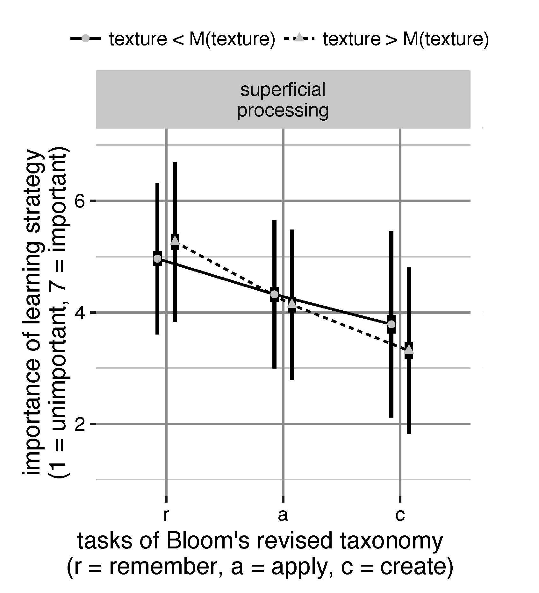

```{r setup, include=FALSE}
library(tufte)
# invalidate cache when the tufte version changes
knitr::opts_chunk$set(tidy = FALSE, cache.extra = packageVersion('tufte'))
options(htmltools.dir.version = FALSE)
```

# Einführung
```{marginfigure_url}
Folien: http://46.101.230.125:3838/Disputation; Quellcode: https://github.com/sammerk/Disputation
```
Der Begriff **Epistemologie** stellt ein modernes Kopositum aus *Episteme (= Erkenntnis, Wissen, Wissenschaft)* und *Logos (= Wissenschaft, Lehre)*^[Meidl, C.N. (2009). *Wissenschaftstheorien für SozialforscherInnen.* Wien: Böhlau.] dar. **Epistemische Überzeugungen** werden in der Literatur als Überzeugungen definiert, welche die Natur und Genese von Wissen betreffen und typischerweise die Aspekte, *Quelle*, *Rechtfertigung*, *Struktur* und *Komplexität* enthalten^[Bråten, I. (2010). Personal Epistemology in Education: Concepts, Issues, and Implications. In: P. Peterson, E. Baker & B. McGaw, (Hrsg.), *International Encyclopedia of Education*, S. 211–217. Oxford: Elsevier.].


## Begriffliche Vielfalt
Der in ersten Forschungsarbeiten verwendete Begriff "epistemologische Überzeugungen" unterliegt der Kritik, Überzeugungen bzgl. der Wissenschafttheorie zu definieren, wohingegen eigentlich Überzeugungen gemeint sind, die Entitäten betreffen, welche auch in der Wissenschaftstheorie vorkommen aber nicht wissenschaftstheoretischer Natur sind. Heute liegt eine Vielzahl an Begrifflichkeiten vor, die jeweils unterschiedlich akzentuierten Konzeptualisierungen unterliegen.
```{r fig-margin1, fig.margin = TRUE, fig.cap = "Begrifflichkeiten nach Greene et al., 2016. Textgröße proportional zu Suchtrefferhäufigkeiten in GoogleScholar.", echo =F, fig.width=2, fig.height=2.5, cache=TRUE, warning=T, message=F}
library(readr)
words <- read_delim("../data/words.csv", 
    ";", escape_double = FALSE)
library(wordcloud)
wordcloud(words$word,words$freq,
random.order=TRUE, random.color=T, rot.per=.0, scale = c(0.8,0.08),
colors=c("#A51E41","#B4A069","#37414B","#7B7D84","#C57974"),ordered.colors=FALSE,use.r.layout=T,
fixed.asp=F, xaxs="i", yaxs="i")
```


## Systematisierung und Kritik gängiger Konzeptualisierungen

Als Hauptproblem der Entwicklungsperspektive werden die starken Annahmen einer eindimensionalen, sequentiellen Entwicklung in diskreten Stufen gesehen (Konstruktvalidität), die empirisch nicht bestätigt werden können und zudem abweichend von den Annahmen operationalisiert werden^[Hofer, B. K., & Pintrich, P. R. (1997). The Development of Epistemological Theories: Beliefs About Knowledge and Knowing and Their Relation to Learning. *Review of Educational Research*, 67(1), 88–140.]. Die Konstruktvalidität der dimensionalen Perspektive wird insbesondere durch eine Interpretation der Dimensionen als "naiv-sophistiziert Kontinuen" geschwächt^[Elby, A., & Hammer, D. (2001). On the substance of a sophisticated epistemology. *Science Education*, 85(5), 554–567.]


# Synopse zentraler Befunde
## Epistemische Überzeugungen sind dualer Natur
```{marginfigure}
**Modellierungsbeispiel:**
$$Rel_{ij} = \beta_{0j} + \beta_{1} \cdot  I^{Thema_1}_{ij} + ... + e_{ij}$$
$$\beta_{0j} = \gamma_{0} + \gamma_{1} \cdot Rel^{global}_{j} + u_{j}$$
Wobei: i und j Indices für Thema und Person darstellen, Rel = Relativismus, I = Konstrastkodierte Indikatorvariable, u bzw. e = Residuen
```
Inwiefern sich epistemologische Unterschiede akademischer Domänen in epistemischen Überzeugungen niederschlagen, ist für Lehramts- studierende in besonderem Maße interessant, da diese vergleichsweise viele Domänen kennenlernen und ihre Curricula vergleichsweise wenig erkenntnistheoretische und methodische Inhalte vorsehen. Bei gegenstandsspezifischer und globaler Erfassung sowie simultaner Mehrebenen-Modellierungen von within- und between-Person Varianz konnte mehrfach Evidenz für die Hypothese einer **dualen Natur** epistemischer Überzeugungen Lehramtsstudierender gefunden werden. Dabei zeigte sich, dass between-Person Effekte der **Domänen**, der **Quelle**, des **Kontextes** etc. weit weniger stark sind, als die within-Person Differenzen über bildungswissenschaftliche Gegenstände hinweg.
```{marginfigure}

Lange/kurze Vertikale Striche = *SD*/*CI*, Punkte/Dreicke = *MW* 
```
## Epistemische Überzeugungen kalibrieren die Lernstrategienwahl
Aus dem COPES-Modell selbstregulierten Lernen sind zwei zentrale Hypothesen zur Rolle epistemischer Überzeugungen diesbezüglich abgeleitet worden - die Kalibrierungs- und die Konsistenzhypothese. Die Kalibrierungshypothese nimmt an, dass epistemische Überzeugungen als "Linse" fungieren, welche bspw. die objektive Komplexität von Aufgaben reinterpretiert.
```{marginfigure}

$X_{ij}^{w/b}$ = within-/between-person Wert der Variable X bzgl. Gegenstand i der Person j, TP/tp = Theorie-Praxis-Integration, di = D-Index (FREE), si = Studieninteresse, $I^{Wis/Exp}$ = Indikatorvariable wissenschaftliche/Experten Quelle, cl = Cognitive Load, ie = Interest-Enjoy, tr = theorienspezifischer Relativismus, KE = Kenntnis  
```

## Epistemische Überzeugungen und Professionalität
Epistemische Überzeugungen sind im kompetenztheoretischen Ansatz generischer Bestandteil von Professionalität im funktionalen Sinne. Im berufsbiographischen Ansatz können epistemische Überzeugungen als notwendige Bedingung für eine angemessene Reflektion der Bezugswissenschaften gesehen werden. Der Bezug zum strukturtheoretischen Ansatz ist weit weniger stark. Es konnte in mehreren Operationalisierungen gezeigt werden, dass die Wahrnehmung bildungswissenschaftlichen Wissens als sinnvoller Bezugsrahmen für pädagogisches Handeln auch nach Kontrolle, der Quelle des Wissens und individueller motivationaler Variablen durch das Entwicklungsniveau epistemischer Überzeugungen prädiziert wird.

## Ausblick
Replikationsstudien auf Large-Scale Daten (BILWIS); Effekte einer Offenlegung des epistemologischen Status und der Erkenntnismethode  bildungswissenschaftlicher Gegenstände. Epistemische Überzeugungen als notwendige Bedingung der Professionalitätsentwicklung.

`

